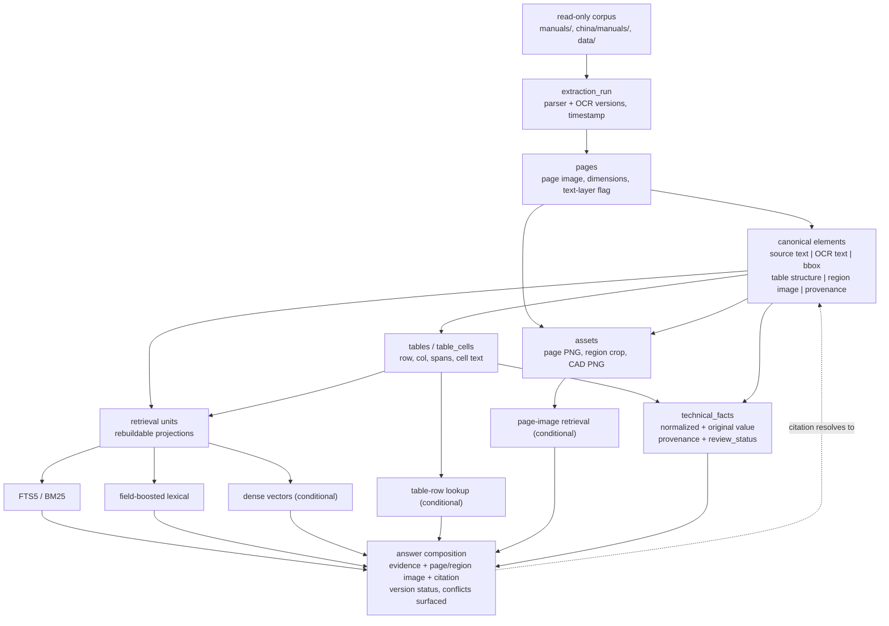

```text
Status: Target architecture / future direction
Authority: Informative, not the MVP implementation contract
```

`docs/mvp-implementation-spec.md` is authoritative wherever scope or sequencing conflicts with anything below.

# Target architecture — vinyl fence evidence store

## 0. What this document is

This describes where the system in this repository may eventually go. It is not a build order. Every
capability below is stated with the observable failure it answers and the test that would show the
capability worked; nothing here should be built because it is a normal part of a RAG stack.

The numbers cited come from `workspace/catalog/corpus-manifest.jsonl`, measured 2026-08-20:

| Measure | Value |
|---|---|
| Catalogued source files | 144 (137 PDF, 6 PNG CAD, 1 DOCX) |
| Total bytes | 432 MB |
| PDF pages | 2140 (2146 including the 6 CAD PNGs) |
| PDFs with a usable text layer | 115 |
| Image-only PDFs requiring OCR | 22, carrying 358 pages |
| Text-layer PDFs containing at least one near-empty page | 12 (20 such pages) |
| Documents under a `structural/` subdirectory | 32, carrying 303 pages |
| Byte-identical duplicate groups (SHA-256) | 14 |
| Distinct `doc_type` values | 19 |
| Documents with a resolved version status | 12 (6 active, 6 superseded); 132 unknown |

Planned extraction routes today: `pdftotext-bbox` (84 documents), `pdftotext-bbox` with per-page OCR
fallback (31), `pdftoppm` + `tesseract` (22), direct `tesseract` on CAD PNGs (6), `docx-xml` (1).

## 1. The evidence-first premise

The valuable material in this corpus is a PE-sealed engineering record. `NOA 23-0314.05` is a
Miami-Dade Notice of Acceptance covering CertainTeed Chesterfield, Columbia, Imperial, Breezewood and
Brookline, approved 2023-05-04, expiring 2029-03-13, carrying Drawing 20-178 sheets 1–9 signed and
sealed by Pedro De Figueiredo, P.E. (Florida PE 52609). Sheet 9 carries "Table 1: Maximum Post Spacing
and Footing Dimensions". Someone will eventually pour concrete based on a number read out of that
sheet, and an inspector will eventually ask which document, which sheet, and which revision it came
from.

That constrains the architecture more than any retrieval consideration does.

### 1.1 Why not chunk-and-embed

The pipeline sketched in `rag-pipeline-plan.md` — extract → OCR → chunk → classify → dedupe → FTS5 —
is a reasonable retrieval recipe and a poor evidence recipe. Applied to this corpus it loses things
that cannot be recovered:

- **Dedup destroys distinct records.** Fourteen SHA-256 groups are byte-identical across paths. NOA
  24-0117.05 exists at four paths (`manuals/barrette-outdoor-living/structural/`,
  `manuals/certainteed-bufftech/structural/`, `manuals/freedom-outdoor-living/structural/`,
  `manuals/industry-standards/structural/`). Those four paths are four *filing facts* — the same
  approval reached this corpus through four brand channels after the CertainTeed fence business
  transferred to Barrette. Collapsing them to one row silently answers "which brands does this NOA
  cover?" wrong.
- **Chunk boundaries destroy conditional tables.** Table 1 has six rows keyed on exposure category and
  footing depth (B/30 in/97 in non-HVHZ, B/24 in/66 in, C/36 in/88 in, C/30 in/68 in, D/36 in/75 in,
  D/30 in/56 in), plus a footing note that lives outside the grid ("12 in diameter footing, 3000 PSI
  concrete, gravel fill at base; hole depth = table footing depth + 6 in"). A character-window chunk
  that splits the grid from the note produces a retrievable, citable, wrong answer.
- **Classification-as-filtering destroys mixed documents.** The audit already found one Freedom
  catalog scoring 189 technical and 98 marketing hits in a single file, and the corpus contains a
  186-page Illusions price catalog and a 112-page Freedom special-order catalog. Whole-document
  keep/drop is not available; page-level drop is a permanent decision made by a heuristic.
- **OCR text is a lossy derivative, not the document.** 358 pages exist only as images. OCR of a
  sealed drawing sheet reading `36` as `3G` is a routine failure. If the OCR string is the only
  artifact retained, the error is undetectable.

### 1.2 Canonical elements versus retrieval units

The separation `guide.md` Phase 2 specifies is the load-bearing idea:

- A **canonical element** is a preserved observation about a region of a page: its exact source-layer
  text, its OCR text stored *beside* rather than over that text, its table structure when it is a
  table, its bounding box, its page and region image, and the extraction run that produced it. It is
  append-only. It is not rewritten when a better parser arrives; a new extraction run produces new
  elements and the old ones remain addressable by the citations already issued against them.
- A **retrieval unit** is a searchable projection built from one or more canonical elements: a
  normalized text field, a heading path, a set of index columns, later possibly an embedding or a
  table row-signature. It is fully derived, carries the id of every canonical element it draws from,
  and is disposable.

The rule is that `workspace/indexes/` can be deleted and rebuilt from `workspace/derived/` plus the
read-only corpus without changing a single answer's provenance. That is what makes retrieval
experiments cheap: the whole of section 3 becomes "add a projection", not "reingest 2140 pages".

It also decides what a citation points at. Citations resolve to canonical element ids, never to
retrieval unit ids. A retrieval unit rebuilt with different tokenization must not invalidate an
answer a contractor printed last month.



## 2. The full evidence graph

The MVP needs a subset. The target shape is:

- **documents** — one row per source path. Identity is the path, so a document keeps its id across
  re-ingestion (`doc_id_for()` in `src/fence_evidence/ids.py`). Carries manufacturer, product family,
  `doc_type`, corpus track (`us` / `china` — these stay separate; the China sources are
  Chinese-language, metric, and reference GB rather than ASTM), and whether it sits under a
  `structural/` subdirectory.
- **document_versions** — one row per (document, SHA-256). Content identity is separate from document
  identity, which is what makes drift detection and reprocessing decisions possible.
- **relations** — typed edges between documents and versions. The types this corpus actually needs:
  - `supersedes` / `superseded_by`: the CertainTeed → Barrette lineage is
    `06-1019.01 → 12-1106.11 (approved 2013-04-04, expired 2018-03-13, renewing 11-1028.05) →
    21-0125.07 (expired 2024-03-13) → 23-0314.05 (2023-05-04 → 2029-03-13, applicant CertainTeed LLC)
    → 24-0117.05 (applicant Barrette Outdoor Living)`, with a parallel molded-fence line
    `22-0616.10 → 24-0117.06` for SimTek. Note that supersession here crosses a *company*, not just a
    revision: the same physical product is approved under a different applicant.
  - `same_content_as`: the 14 byte-identical groups. This is how deduplication is expressed without
    deletion — four document rows, one shared content hash, one shared set of canonical elements,
    four filing contexts.
  - `renews`, `cites_evidence`, `variant_of`: the NOA "Evidence Submitted" logs reference PE
    compliance letters that are themselves pages inside the same PDF; a `cites_evidence` edge from
    the approval to the letter element makes "what evidence supports this NOA?" answerable.
- **pages** — page number, rendered page image, dimensions, text-layer availability. Note that one
  source (`manuals/illusions-vinyl-fence/extra-strong-hinge-brochure.pdf`) is AES-encrypted with copy
  disallowed; page-level status must be able to record "render succeeded, text extraction refused".
- **elements** — the canonical unit described in 1.2, with `element_type` in
  `{paragraph, heading, table, figure, drawing, list, caption, label}` and a heading path.
- **assets** — page renders, region crops, and the 6 Weatherables CAD PNGs, which are documents whose
  only element is a drawing.
- **tables / table_cells** — preserved grid structure with row/column indices and spans, kept
  alongside (not instead of) the flattened text and the region image.
- **extraction_runs** — tool identity and version for every derived artifact; see 7.2.
- **quality_issues** — typed, triageable defects attached to a document, page, or element; see 7.4.
- **technical_facts** — section 4.

## 3. Retrieval evolution

Lexical FTS5 BM25 is the starting point and stays the default. This corpus is dense with exact
tokens — `23-0314.05`, `Chesterfield`, `Exposure C`, `ASTM F964`, `G-60`, `20-178` — where BM25 is
strong and embeddings are actively worse. Everything below is conditional. The trigger is always a
*measured* failure category from the gold set (`eval/gold-question-schema.json` defines twelve
categories); the acceptance criterion is always "improves the target category without regressing the
others".

### R1 — Field-boosted lexical

```text
Problem:
Identifier and product queries retrieve the wrong document family. A "wind load
post spacing" query surfaces the 49-page CLFMI Chain-Link Wind Load Guide, which
is chain-link, not vinyl. A query for "NOA 23-0314.05" surfaces documents that
merely mention the number ahead of the approval itself.

Experiment:
Weight BM25 columns (title, heading_path, identifier tokens) above body text; add
structured filters for manufacturer, product family, corpus track and doc_type.

Acceptance:
MRR on the exact_identifier and exact_product categories improves, with zero
regression on conditional_table_lookup and table_retrieval. Cost: one index
rebuild, no new dependency.
```

### R2 — Dense semantic retrieval

```text
Problem:
Paraphrase queries fail. "How is a post strengthened for high-wind installation?"
does not lexically match "U-SHAPPED G-60 STEEL CHANNEL X 92" on Drawing 20-178
sheet 8, nor the aluminum post reinforcement item P1 on sheet 7.

Experiment:
Embed retrieval units only (never canonical elements) for the pilot subset. Run
as a second ranker fused with BM25, not as a replacement.

Acceptance:
Recall@10 on the paraphrase category improves by a margin larger than the
evaluation noise, and exact_identifier / conditional_table_lookup performance is
unchanged. If BM25 alone already answers the paraphrase set, this is not built.
Requires an offline embedding model; a hosted vector service is out of scope
(section 8).
```

### R3 — Table-aware structured lookup

```text
Problem:
Conditional queries retrieve the right table and the wrong row. "What footing
depth applies at Exposure C?" against Table 1 must return 36 in at 88 in spacing
or 30 in at 68 in spacing — two valid rows differing by post spacing — and must
not return the Exposure B or D rows.

Experiment:
Index table_cells with their row/column context so a query carrying conditions
can constrain rows before ranking, and return the full row plus its out-of-grid
notes ("hole depth = table footing depth + 6 in").

Acceptance:
conditional_table_lookup questions return the correct row set, including the
multi-row cases, and the returned evidence contains the footing-note text. A
partial row that omits the +6 in note counts as a failure.

Scoping note: Table 1 is keyed on exposure category and post spacing, not on wind
speed. The product rating is 75 mph fastest-mile / 115 mph ultimate 3-second
gust. A query at "130 mph" is outside the rated envelope of this product and the
correct behaviour is to say so, not to interpolate. Any structured lookup layer
must be able to return "out of documented range" as a first-class result.
```

### R4 — Visual / page-level retrieval

```text
Problem:
Drawing-heavy sources are unreachable by text. The 6 Weatherables CAD PNGs carry
almost no OCR-able text; 16 of the 22 image-only PDFs are NOA packages whose
value is dimensioned section details and footing details, and whose OCR yield on
a sealed drawing sheet is poor.

Experiment:
Add page-image retrieval (visual embedding or an image-text model) restricted to
documents flagged drawing-heavy, ranked alongside lexical hits rather than
replacing them.

Acceptance:
visual_evidence recall on the annotated gold questions improves, and the returned
page or region image is the one the annotation names. Text-query performance on
the other eleven categories is unchanged.
```

### R5 — Version-aware ranking

Not an add-on so much as a promotion. Once supersession edges exist, the default ranking should prefer
`active` document versions and still return superseded ones, labelled. Trigger: any
`current_version` / `historical_version` gold question returning an expired approval without a status
label. Acceptance: both categories pass with the correct status on every returned result.

## 4. Structured technical facts layer

Retrieval finds pages. Comparison questions ("compare footing requirements for two product families")
need values. The facts layer is a *derived index over evidence*, never a substitute for it.

### 4.1 Shape

One row per asserted value, with columns for: product, model or component, dimension name, value
(normalized), value (original string), unit (normalized), unit (original), wind speed, exposure
category, HVHZ applicability, post spacing, footing depth, footing diameter, concrete strength,
reinforcement description, approval identifier, effective date, expiration date, superseded-by, and
the standard invoked (ASCE 7-10, ASTM F964-13, IBC 1807.3.3, CSI 32 31 23).

Mandatory on every row, non-nullable: `document_id`, `version_id`, `page_no`, `element_id`,
`extraction_run_id`. A fact with no element to point at cannot be inserted. This is prohibition 11
enforced at the schema level rather than in the answer layer.

### 4.2 Both values, always

`96-1/8` in a bill of materials, `75-1/2` on drawing sheet 6, `1.700 in x 1.775 in` for the channel
legs, `0.080 in` wall thickness, `92` in for the channel length — normalization to decimal inches is
useful for comparison and lossy for citation. Prohibition 7 requires both. The original string is what
gets quoted back to the user; the normalized value is what gets compared. When they disagree — a
rounding bug, a fraction parsed wrong — the disagreement is visible instead of buried.

The same applies across tracks: the China sources are metric and reference GB standards. Converted
values must never appear without the original, and a US/China cross-track comparison should be
refused by default rather than silently unit-converted.

### 4.3 Promotion from extracted to reviewed

`review_status` moves through `extracted → flagged → reviewed → rejected`.

- `extracted`: produced by a parser or OCR run. Never surfaced as an authoritative value in an answer;
  it may be surfaced as "an extracted candidate, unreviewed" alongside its page image.
- `flagged`: automatic checks failed — the source page is OCR-only, the normalized and original values
  disagree, the value is an outlier against sibling facts, or two facts for the same
  (product, dimension, condition) tuple conflict.
- `reviewed`: a human compared the value against the region image and recorded who and when.
- `rejected`: the extraction was wrong; the row is kept, marked, and linked to the corrected row.
  Rejected facts are not deleted, because the same bad extraction will otherwise be re-derived on the
  next run with no memory that it was already wrong.

Any fact derived from a page whose text came from OCR carries an `ocr_derived` flag that follows it
into the answer. For this corpus that is a large fraction of the highest-value facts: the entire
Table 1 lineage lives on scanned drawing sheets.

Review effort should be spent where it pays. The 12 documents with resolved version status and the 32
structural documents are worth a full review pass; the 6 warranty documents are worth none.

## 5. Answer composition

A technical answer is assembled, not generated. The composition contract:

1. **Retrieve** evidence via one or more of the modes in section 3, each result carrying its retrieval
   reason.
2. **Attach imagery** — the page image, and the region crop when the answer rests on a table cell or a
   drawing detail. For anything sourced from a scanned NOA this is not optional; the image is the only
   way a reader can check the OCR.
3. **Cite** — document title, source path, version, page number, element id, and heading path, on
   every value.
4. **Label status** — `active`, `superseded`, `expired`, or `unknown`, with the supersession chain
   when one exists. 132 of 144 documents currently have `unknown` status; `unknown` must be displayed
   as unknown, never as active.

### 5.1 The hard rule

No technical value is emitted without document, page, and element provenance. If the evidence store
cannot supply all three, the system says it cannot answer. Free-text summarisation that is not backed
by an element id is not an answer, it is a liability — these are sealed engineering documents and a
plausible unsourced number is worse than a refusal.

### 5.2 Conflicts are surfaced, not resolved

The corpus already contains a live disagreement about its own metadata. The manifest records
`NOA 23-0314.05` with `version_status: active`, while `data/structural/certainteed-bufftech-structural.json`
records the same approval as "Superseded (by 24-0117.05, filed under new applicant Barrette Outdoor
Living after the CertainTeed fence business transfer)". Both are curated records in this repository.
An architecture that picks a winner silently would have hidden this.

The rule: when two sources give different values for the same question, return both, with their
citations, dates, and version status, and state the nature of the disagreement. Order by evidence
strength (an active PE-sealed approval outranks a marketing catalog) but never suppress the loser.

Scope conflicts get the same treatment. ASTM F964 explicitly does not cover load-bearing or wind-load
engineering for vinyl fence assemblies; a wind-load answer sourced from F964 content is a
category error, and the facts layer should be able to record "this standard is out of scope for this
question" as an assertion with its own citation.

### 5.3 No-answer behaviour

The gold set has a `no_answer` category and an `answerable: false` flag for a reason. "Not documented
in this corpus" is a correct, valuable answer for a system whose users are otherwise going to guess.
Composition must distinguish four states: documented; documented but superseded; outside the
documented range (the 130 mph case in R3); and not documented.

## 6. Interfaces

Three surfaces, one contract.

- **Python API** — `src/fence_evidence/` as the library. The Phase 3 verbs (`search_evidence`,
  `get_document`, `get_page`, `get_region`, `get_element_context`, `resolve_document_version`) plus,
  later, `lookup_facts`, `compare_facts`, `resolve_supersession_chain`, `get_table`. Stable
  signatures; additive change only.
- **CLI** — a thin wrapper over the same functions, for corpus operators: ingest, reindex, search,
  show page, export citations, list quality issues. The CLI must never contain logic the API lacks.
- **MCP server (future)** — exposes the same verbs as tools so an agent can query the evidence store
  without shelling out. Read-only by construction: no tool that writes to the corpus, no tool that
  executes a path or URL taken from document content. Trigger for building it: an actual agent
  consumer exists. Acceptance: the MCP tool results are byte-equivalent to the Python API results for
  the full gold set.

### 6.1 The contract is the response, not the schema

The integration point is the retrieval response object sketched in `guide.md` Phase 3 —
`document_id`, `title`, `status`, `page`, `element_id`, `element_type`, `heading_path`, `text`,
`page_image_path`, `region_image_path`, `bbox`, `retrieval_reason` — extended over time with
`version_id`, `ocr_derived`, `supersedes` / `superseded_by`, `conflicts_with`, and `confidence`.

Consumers bind to that object. They must not bind to SQLite tables. Every change in section 3 alters
the index layout and adds a `retrieval_reason.mode` value; none of them should alter the response
fields a client already reads. If a retrieval experiment cannot be expressed as a new
`retrieval_reason` inside the existing response, that is a signal the experiment is changing the
product, not the ranking.

`retrieval_reason` is also the debugging surface. "Why did I get this?" must be answerable from the
response alone — matched terms for lexical, matched row conditions for table lookup, neighbour
distance for vector, source mode for fused results.

## 7. Operational concerns

### 7.1 Idempotent, resumable ingestion

Work is keyed on `(source_path, sha256, extraction_tool_versions)`. An unchanged file with an
unchanged toolchain is skipped. Ingestion of 2140 pages including OCR of 358 scanned pages is long
enough that it will be interrupted; every stage checkpoints per document, and a rerun resumes rather
than restarts. Reprocessing is triggered explicitly, by content change or tool upgrade, never by a
run being re-invoked.

### 7.2 Extraction-run provenance

Every derived artifact records the run that made it: tool name and version for `pdftotext`,
`pdftoppm`, `pdfplumber` (0.11.10 is vendored in `workspace/pylibs/`), `pdfminer.six`, and `tesseract`
(including language packs and PSM settings), plus timestamp and parameters. Two purposes: when a
number is disputed, the exact toolchain that produced it is recoverable; and when a tool is upgraded,
the set of artifacts needing regeneration is a query rather than a guess.

### 7.3 Corpus drift detection

The manifest stores a SHA-256 for all 144 files. A periodic check recomputes them and reports:
changed content at a known path (a source was replaced — new `document_version`, supersession edge
candidate), a missing path, and a new path. Changed content never overwrites the previous version's
elements. This is also the guard on the read-only rule: a hash that changes without an intentional
corpus update means something wrote where it should not have.

### 7.4 Quality-issue triage

Quality issues are rows, not log lines, so they can be counted, assigned, and closed. The categories
this corpus will generate: zero-text page in a text-layer document (20 known pages across 12
documents); OCR confidence below threshold on a page carrying numeric values; table detected with
ragged rows; page render failure; encrypted source (the Illusions hinge brochure); element with no
bounding box; fact whose normalized and original values disagree; document whose `doc_type` is
`unspecified` (12 documents).

Prohibition 12 makes this a gate: an ingestion run reporting success while pages, tables, images, or
OCR coverage are missing is a failed run. Coverage is reported as a fraction of expected pages,
expected tables, and expected images, per document, and the run's exit status depends on it.

### 7.5 Read-only corpus boundary

Enforced in code, not by convention — `ensure_writable()` in `src/fence_evidence/paths.py` refuses any
write outside `workspace/`. Every writing path routes through it. Corpus content is data: no path,
URL, macro, or embedded action extracted from a document is ever executed, opened, or resolved.
Document text never becomes an instruction. This applies with particular force to the facts layer,
where extracted strings flow into structured fields and from there into answers.

## 8. Explicit non-goals and deferred work

| Not building | Why | Revisit when |
|---|---|---|
| Vector database service (Pinecone, Weaviate, Qdrant, pgvector) | 144 documents. SQLite FTS5 handles the corpus with no dependency and no service to operate. | R2 passes its acceptance test *and* an offline index over ~2100 pages proves too slow in-process — a condition unlikely to be reached at this scale. |
| Graph database | The supersession lineages are shallow: the longest chain here is five NOAs. A `relations` table with recursive CTEs covers it. | Relation traversal becomes a query bottleneck or the edge types outgrow a single table. |
| Distributed services, queues, workers | Full ingestion is a single long-running local job. | Corpus grows by an order of magnitude or ingestion must run continuously. |
| LLM summarisation replacing sources | Prohibition 2. A generated paraphrase of a sealed drawing is not evidence and cannot be cited to an inspector. | Never for the canonical store. A generated *reading aid*, displayed beside the page image and labelled as generated, is acceptable. |
| Destructive deduplication | Prohibition 1 and section 1.1: the 14 identical groups carry distinct filing context. | Never. Dedup is expressed as `same_content_as` edges and shared elements. |
| Content filtering / dropping marketing and warranty text | Prohibition 3. Catalogs are mixed within a single file; dropping pages loses dimension tables. | Never as deletion. Classification may down-rank at retrieval time only, and the classification must be reversible. |
| Merging the US and China tracks | Different languages, unit systems, and standards bodies (GB vs. ASTM). | A concrete cross-track question exists and unit/standard provenance is strong enough to answer it without silent conversion. |
| Automatic conflict resolution | Section 5.2. Picking a winner hides exactly the disagreements a user needs. | Never for technical values. Ordering by evidence strength is allowed; suppression is not. |
| Write access of any kind to the corpus | Prohibition 1. | Never. |
